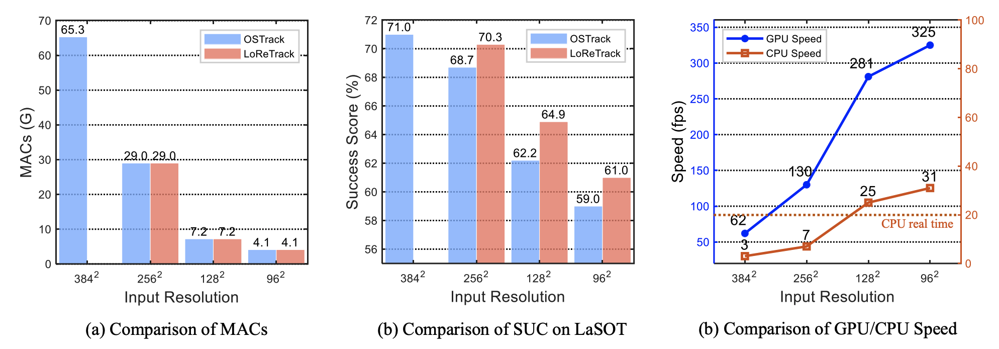

# LoReTrack

<p align="center"></p>

This project provides the code and results for [LoReTrack: Efficient and Accurate Low-Resolution Transformer Tracking](https://arxiv.org/pdf/2405.17660), IROS 2025 (**Oral**)

Anchors: [Shaohua Dong](https://scholar.google.com/citations?user=5iSEcFkAAAAJ&hl=en), [Yunhe Feng](https://yunhefeng.me/), [James C. Liang](https://jamesliang819.github.io/), [Qing Yang](https://scholar.google.com/citations?user=FIMxNL0AAAAJ&hl=zh-CN), [Yuewei Lin](https://ywlincq.github.io/), [Heng Fan](https://hengfan2010.github.io/)

PaperLink: https://arxiv.org/pdf/2405.17660


## Highlights
### 
LoReTrack introduces a resolution-scalable Transformer tracker that achieves efficient and accurate low-resolution tracking by distilling global and target-aware knowledge from a frozen high-resolution counterpart through two simple yet effective distillation modules, which can also be easily applied to other trackers.

<p align="center"></p>

## Results and Weights

| Tracker       | LaSOT (AUC)                              | LaSOText (AUC)                           | GOT-10k (AO)                              | TrackingNet (AUC)                           | UAV123 (AUC)                              | Device | FPS  |
|:-------------:|:-----------------------------------------:|:----------------------------------------:|:------------------------------------------:|:-------------------------------------------:|:------------------------------------------:|:------:|:----:|
| LoReTrack-256 | 70.3 <br><sub>[weight](https://drive.google.com/drive/folders/1BCZL7cniQ7RzdoYJAFWu25uo9eBs7rqt) \| [raw results](https://drive.google.com/drive/folders/1BCZL7cniQ7RzdoYJAFWu25uo9eBs7rqt)</sub> | 51.3 <br><sub>[weight](https://drive.google.com/drive/folders/1j0byzcJ0R7-F1KHmt6vL3tHZk9f3EZZO) \| [raw results](https://drive.google.com/drive/folders/1j0byzcJ0R7-F1KHmt6vL3tHZk9f3EZZO)</sub> | 73.5 <br><sub>[weight](#) \| [raw results](#)</sub> | 82.9 <br><sub>[weight](#) \| [raw results](#)</sub> | 70.6 <br><sub>[weight](https://drive.google.com/drive/folders/19KwcJmfmfxOyf8SuPGyHuTXaQrgCeTGM) \| [raw results](https://drive.google.com/drive/folders/19KwcJmfmfxOyf8SuPGyHuTXaQrgCeTGM)</sub> | GPU    | 130  |
| LoReTrack-192 | 68.6 <br><sub>[weight](#) \| [raw results](#)</sub> | 50.0 <br><sub>[weight](#) \| [raw results](#)</sub> | 71.5 <br><sub>[weight](#) \| [raw results](#)</sub> | 80.9 <br><sub>[weight](#) \| [raw results](#)</sub> | 69.9 <br><sub>[weight](#) \| [raw results](#)</sub> | GPU    | 186  |
| LoReTrack-128 | 64.9 <br><sub>[weight](#) \| [raw results](#)</sub> | 46.4 <br><sub>[weight](#) \| [raw results](#)</sub> | 64.3 <br><sub>[weight](#) \| [raw results](#)</sub> | 77.7 <br><sub>[weight](#) \| [raw results](#)</sub> | 69.0 <br><sub>[weight](#) \| [raw results](#)</sub> | CPU    | 25   |
| LoReTrack-96  | 61.0 <br><sub>[weight](#) \| [raw results](#)</sub> | 45.1 <br><sub>[weight](#) \| [raw results](#)</sub> | 58.9 <br><sub>[weight](#) \| [raw results](#)</sub> | 74.0 <br><sub>[weight](#) \| [raw results](#)</sub> | 67.1 <br><sub>[weight](#) \| [raw results](#)</sub> | CPU    | 31   |


The inference was performed using a single NVIDIA RTX A5500 GPU and an Intel Core i9-11900K CPU.


## Install the environment (Follow [OSTrack](https://github.com/botaoye/OSTrack))
**Option1**: Use the Anaconda (CUDA 10.2)
```
conda create -n ostrack python=3.8
conda activate ostrack
bash install.sh
```

**Option2**: Use the Anaconda (CUDA 11.3)
```
conda env create -f ostrack_cuda113_env.yaml
```


## Set project paths
Run the following command to set paths for this project
```
python tracking/create_default_local_file.py --workspace_dir . --data_dir ./data --save_dir ./output
```
After running this command, you can also modify paths by editing these two files
```
lib/train/admin/local.py  # paths about training
lib/test/evaluation/local.py  # paths about testing
```

## Data Preparation
Put the tracking datasets in ./data. It should look like this:
   ```
   ${PROJECT_ROOT}
    -- data
        -- lasot
            |-- airplane
            |-- basketball
            |-- bear
            ...
        -- got10k
            |-- test
            |-- train
            |-- val
        -- coco
            |-- annotations
            |-- images
        -- trackingnet
            |-- TRAIN_0
            |-- TRAIN_1
            ...
            |-- TRAIN_11
            |-- TEST
   ```
For the LaSOText and UAV123 datasets, only testing was performed.
