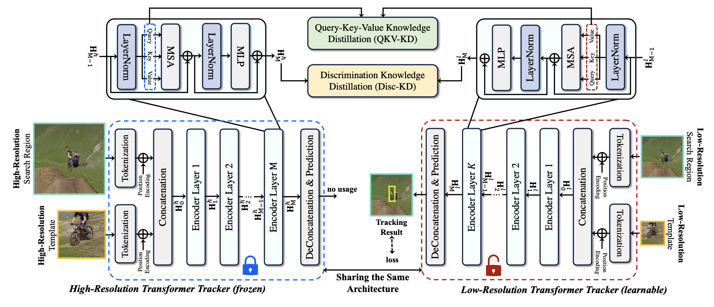

# LoReTrack

<p align="center"></p>

This project provides the code and results for [LoReTrack: Efficient and Accurate Low-Resolution Transformer Tracking](https://arxiv.org/pdf/2405.17660), IROS 2025 (**Oral**)

Authors: [Shaohua Dong](https://scholar.google.com/citations?user=5iSEcFkAAAAJ&hl=en), [Yunhe Feng](https://yunhefeng.me/), [James Liang](https://jamesliang819.github.io/), [Qing Yang](https://scholar.google.com/citations?user=FIMxNL0AAAAJ&hl=zh-CN), [Yuewei Lin](https://ywlincq.github.io/), [Heng Fan](https://hengfan2010.github.io/)

PaperLink: https://arxiv.org/pdf/2405.17660


## Highlights
### 
LoReTrack introduces a resolution-scalable Transformer tracker that achieves efficient and accurate low-resolution tracking by distilling global and target-aware knowledge from a frozen high-resolution counterpart through two simple yet effective distillation modules, which can also be easily applied to other trackers.

<p align="center"></p>

## Results and Weights

| **Tracker**     | **LaSOT (AUC)**                            | **LaSOText (AUC)**                         | **GOT-10k (AO)**                           | **TrackingNet (AUC)**                       | **UAV123 (AUC)**                            | **Device** | **FPS** |
|:---------------:|:------------------------------------------:|:------------------------------------------:|:------------------------------------------:|:-------------------------------------------:|:------------------------------------------:|:---------:|:------:|
| LoReTrack-256   | 70.3<br><sub>[weight](https://drive.google.com/drive/folders/1BCZL7cniQ7RzdoYJAFWu25uo9eBs7rqt)</sub><br><sub>[raw results](https://drive.google.com/drive/folders/1BCZL7cniQ7RzdoYJAFWu25uo9eBs7rqt)</sub> | 51.3<br><sub>[weight](https://drive.google.com/drive/folders/1j0byzcJ0R7-F1KHmt6vL3tHZk9f3EZZO)</sub><br><sub>[raw results](https://drive.google.com/drive/folders/1j0byzcJ0R7-F1KHmt6vL3tHZk9f3EZZO)</sub> | 73.5<br><sub>[weight](#)</sub><br><sub>[raw results](#)</sub> | 82.9<br><sub>[weight](#)</sub><br><sub>[raw results](#)</sub> | 70.6<br><sub>[weight](https://drive.google.com/drive/folders/19KwcJmfmfxOyf8SuPGyHuTXaQrgCeTGM)</sub><br><sub>[raw results](https://drive.google.com/drive/folders/19KwcJmfmfxOyf8SuPGyHuTXaQrgCeTGM)</sub> | GPU       | 130    |
| LoReTrack-192   | 68.6<br><sub>[weight](#)</sub><br><sub>[raw results](#)</sub> | 50.0<br><sub>[weight](#)</sub><br><sub>[raw results](#)</sub> | 71.5<br><sub>[weight](#)</sub><br><sub>[raw results](#)</sub> | 80.9<br><sub>[weight](#)</sub><br><sub>[raw results](#)</sub> | 69.9<br><sub>[weight](#)</sub><br><sub>[raw results](#)</sub> | GPU       | 186    |
| LoReTrack-128   | 64.9<br><sub>[weight](#)</sub><br><sub>[raw results](#)</sub> | 46.4<br><sub>[weight](#)</sub><br><sub>[raw results](#)</sub> | 64.3<br><sub>[weight](#)</sub><br><sub>[raw results](#)</sub> | 77.7<br><sub>[weight](#)</sub><br><sub>[raw results](#)</sub> | 69.0<br><sub>[weight](#)</sub><br><sub>[raw results](#)</sub> | CPU       | 25     |
| LoReTrack-96    | 61.0<br><sub>[weight](#)</sub><br><sub>[raw results](#)</sub> | 45.1<br><sub>[weight](#)</sub><br><sub>[raw results](#)</sub> | 58.9<br><sub>[weight](#)</sub><br><sub>[raw results](#)</sub> | 74.0<br><sub>[weight](#)</sub><br><sub>[raw results](#)</sub> | 67.1<br><sub>[weight](#)</sub><br><sub>[raw results](#)</sub> | CPU       | 31     |


The inference was performed using a single NVIDIA RTX A5500 GPU and an Intel Core i9-11900K CPU.


## Install the environment (Follow [OSTrack](https://github.com/botaoye/OSTrack))
**Option1**: Use the Anaconda (CUDA 10.2)
```
conda create -n ostrack python=3.8
conda activate ostrack
bash install.sh
```

**Option2**: Use the Anaconda (CUDA 11.3)
```
conda env create -f ostrack_cuda113_env.yaml
```


## Set project paths
Run the following command to set paths for this project
```
python tracking/create_default_local_file.py --workspace_dir . --data_dir ./data --save_dir ./output
```
After running this command, you can also modify paths by editing these two files
```
lib/train/admin/local.py  # paths about training
lib/test/evaluation/local.py  # paths about testing
```

## Data Preparation
Put the tracking datasets in ./data. It should look like this:
   ```
   ${PROJECT_ROOT}
    -- data
        -- lasot
            |-- airplane
            |-- basketball
            |-- bear
            ...
        -- got10k
            |-- test
            |-- train
            |-- val
        -- coco
            |-- annotations
            |-- images
        -- trackingnet
            |-- TRAIN_0
            |-- TRAIN_1
            ...
            |-- TRAIN_11
            |-- TEST
   ```
For the LaSOText and UAV123 datasets, only testing was performed.

## Training
Download [OSTrack weights](https://drive.google.com/drive/folders/1ov2nU3itkR5FJBn_wiapMGxpsL6aB5f6) and put it under `$PROJECT_ROOT$/pretrained_models`.

```
python tracking/train.py --script ostrack --config vitb_256_mae_32x4_ep300 --save_dir ./output --mode multiple --nproc_per_node 4 --use_wandb 1
```

Replace `--config` with the desired model config under `experiments/ostrack`. We use [wandb](https://github.com/wandb/client) to record detailed training logs, in case you don't want to use wandb, set `--use_wandb 0`.


## Evaluation
Download the model weights from [Google Drive](https://drive.google.com/drive/folders/1Vu8MKmWDDGKwcrViSSSYLiN7IMip4dsf), as linked in the table above.

Put the downloaded weights on `$PROJECT_ROOT$/output/checkpoints/train/ostrack`

Change the corresponding values of `lib/test/evaluation/local.py` to the actual benchmark saving paths

Some testing examples:
- LaSOT or other off-line evaluated benchmarks (LaSOText, UAV123) (modify `--dataset` correspondingly)
```
python tracking/test.py ostrack vitb_384_mae_32x4_ep300 --dataset lasot --threads 16 --num_gpus 4
python tracking/analysis_results.py # need to modify tracker configs and names
```
- GOT10K-test
```
python tracking/test.py ostrack vitb_384_mae_32x4_got10k_ep100 --dataset got10k_test --threads 16 --num_gpus 4
python lib/test/utils/transform_got10k.py --tracker_name ostrack --cfg_name vitb_384_mae_32x4_got10k_ep100
```
- TrackingNet
```
python tracking/test.py ostrack vitb_384_mae_32x4_ep300 --dataset trackingnet --threads 16 --num_gpus 4
python lib/test/utils/transform_trackingnet.py --tracker_name ostrack --cfg_name vitb_384_mae_32x4_ep300
```

## Test FLOPs, and Speed

```
# Profiling vitb_256_mae_32x4_ep300
python tracking/profile_model.py --script ostrack --config vitb_256_mae_32x4_ep300
```


## Acknowledgments
* Thanks for the [OSTrack](https://github.com/botaoye/OSTrack) and [PyTracking](https://github.com/visionml/pytracking) library, which helps us to quickly implement our ideas.


## Citation
If our work is useful for your research, please consider citing:

```Bibtex
@article{dong2024loretrack,
  title={Loretrack: efficient and accurate low-resolution transformer tracking},
  author={Dong, Shaohua and Feng, Yunhe and Yang, Qing and Lin, Yuewei and Fan, Heng},
  journal={arXiv preprint arXiv:2405.17660},
  year={2024}
}
```
